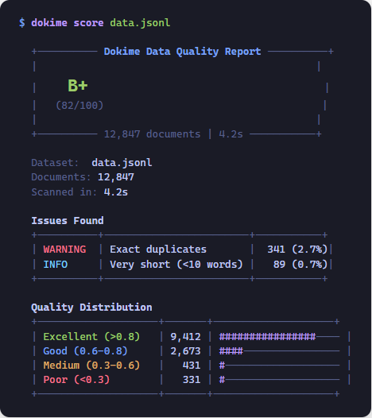

<p align="center">
  <picture>
    <source media="(prefers-color-scheme: dark)" srcset="docs/assets/logo-dark.svg" />
    <source media="(prefers-color-scheme: light)" srcset="docs/assets/logo.svg" />
    
  </picture>
</p>

<h3 align="center">pytest for your training data.</h3>

<p align="center">
  <a href="https://pypi.org/project/dokime/"></a>
  <a href="https://pypi.org/project/dokime/"></a>
  <a href="https://github.com/dokime-ai/dokime/blob/main/LICENSE"></a>
  <a href="https://github.com/dokime-ai/dokime/actions"></a>
</p>

<p align="center">
  <a href="#quick-start">Quick Start</a> &bull;
  <a href="#installation">Install</a> &bull;
  <a href="https://dokime-ai.github.io/dokime">Docs</a> &bull;
  <a href="CONTRIBUTING.md">Contribute</a>
</p>

---

One command to grade your ML training data. Filter junk, deduplicate, score quality, find outliers, and search — from a single `pip install`.

<p align="center">
  
</p>

## Installation

```bash
pip install dokime
```

For the full toolkit (embeddings, fuzzy dedup, language detection):

```bash
pip install "dokime[all]"
```

<details>
<summary>Pick individual extras</summary>

| Extra | What it adds |
|---|---|
| `dokime[embeddings]` | Sentence-transformer embeddings, FAISS search, semantic dedup |
| `dokime[dedup]` | MinHash-LSH fuzzy deduplication |
| `dokime[nlp]` | Language detection (lingua) |
| `dokime[io]` | HuggingFace `datasets`, Pandas |
| `dokime[explore]` | Interactive web UI |

</details>

## Quick Start

Score your data in one command:

```bash
dokime score data.jsonl
```

Build a curation pipeline:

```python
from dokime.core.pipeline import Pipeline
from dokime.core.filters import LengthFilter, WhitespaceFilter, RepetitionFilter
from dokime.quality.dedup import ExactDedup

pipeline = Pipeline("my-curation")
pipeline.add_filter(LengthFilter(min_length=50, max_length=100_000))
pipeline.add_filter(WhitespaceFilter(max_whitespace_ratio=0.4))
pipeline.add_filter(RepetitionFilter(max_repetition_ratio=0.3))
pipeline.add_filter(ExactDedup())

result = pipeline.run("data/raw.jsonl", "data/curated.parquet")
print(f"Kept {result['total_kept']:,} / {result['total_read']:,} documents")
```

Or from the CLI:

```bash
dokime curate data/raw.jsonl data/clean.parquet \
  --min-length 50 --max-whitespace 0.4 --dedup
```

## What's in the box

**Quality scoring** — Grade your dataset A-F with per-document signals: entropy, character ratios, word count, repetition detection.

**12 heuristic filters** — Length, word count, whitespace, repetition, special characters, alphabetic ratio, URLs, stopwords, language, field existence, regex. All composable via code or YAML.

**3 dedup strategies** — Exact (SHA-256), fuzzy (MinHash-LSH), and semantic (embedding cosine similarity).

**Embeddings & search** — Compute sentence-transformer embeddings, FAISS-backed search, k-NN anomaly/outlier detection.

**Pipeline orchestration** — Chain filters, configure via YAML, streaming execution with constant memory, per-filter removal stats.

**10 CLI commands** — `version`, `curate`, `stats`, `embed`, `search`, `outliers`, `score`, `push`, `attribute`, `explore`.

## Documentation

Full docs at **[dokime-ai.github.io/dokime](https://dokime-ai.github.io/dokime)**.

## Contributing

We welcome contributions. See [CONTRIBUTING.md](CONTRIBUTING.md) for setup instructions.

## License

Apache 2.0 — see [LICENSE](LICENSE).
